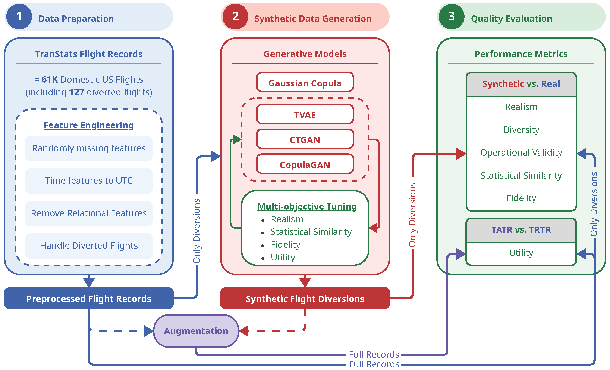
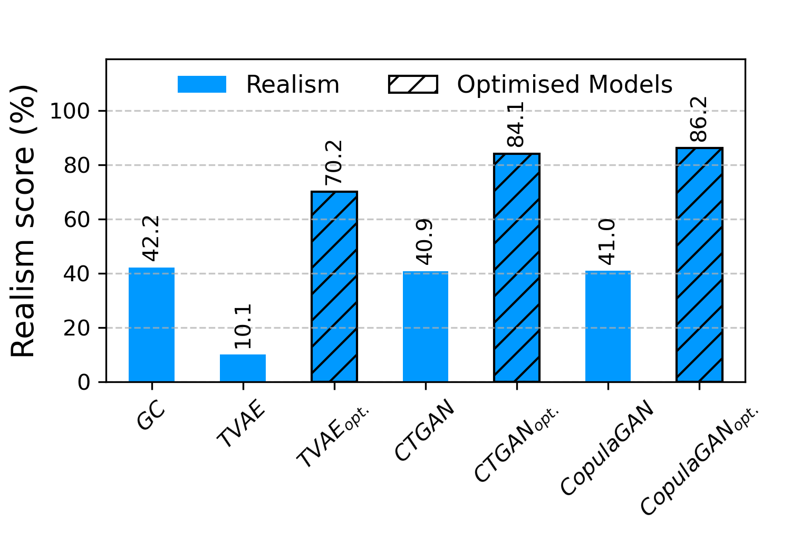
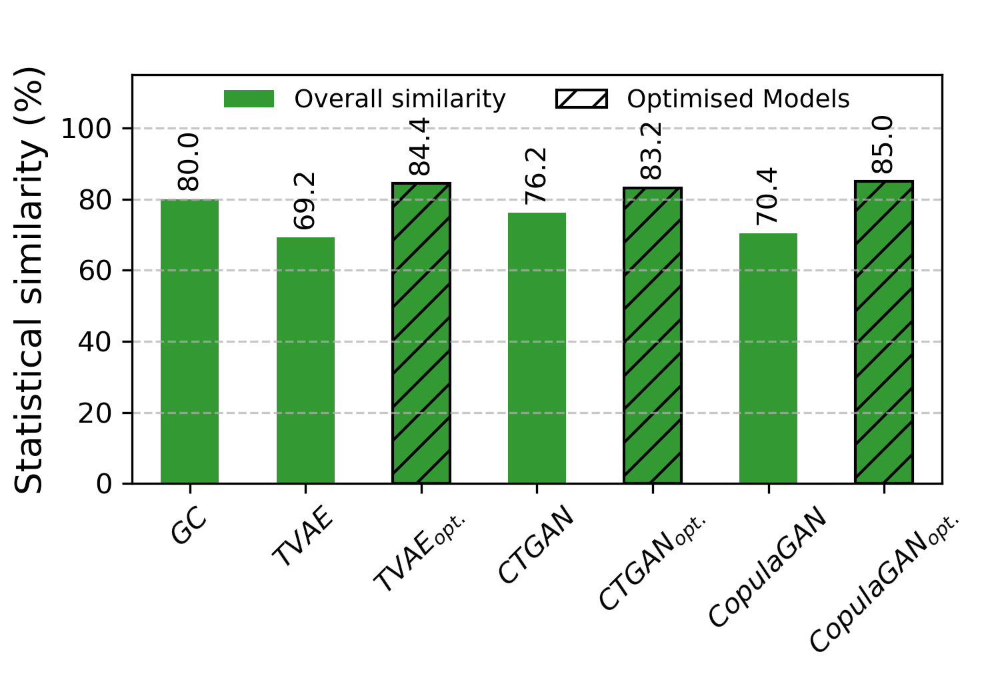
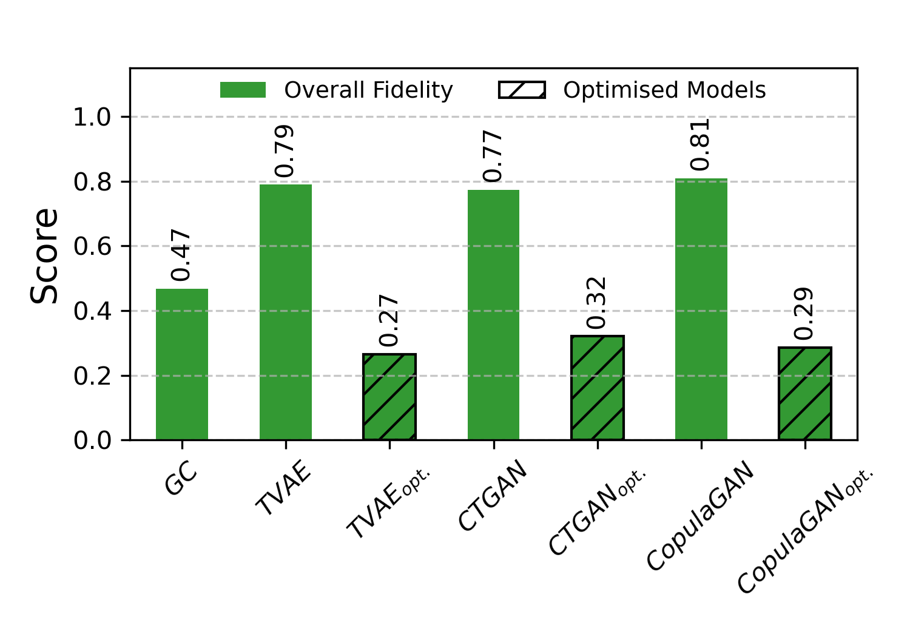
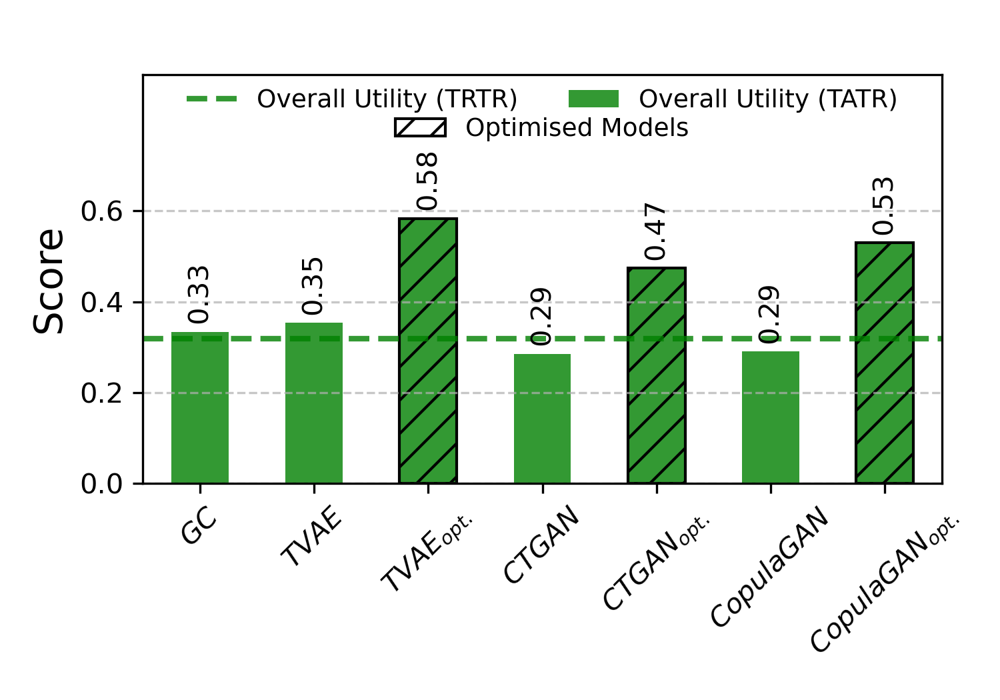

# ✈️ SynFlyDiv: Synthetic Flight Diversion Records

This study aims to improve the prediction of rare events—specifically flight diversions—by enriching highly imbalanced historical datasets with high-fidelity synthetic samples through multi-objective-optimised generative models.

## 📄 Paper

This repository accompanies the paper: **_Generative Augmentation of Imbalanced Flight Records for Flight Diversion Prediction: A Multi-objective Optimisation Framework_**
- ArXiv (preprint): [https://arxiv.org/abs/2604.20288](https://arxiv.org/abs/2604.20288).
- Hugging Face 🤗: [https://huggingface.co/papers/2604.20288](https://huggingface.co/papers/2604.20288).

This work builds upon our earlier publication, **_Synthetic Flight Data Generation Using Generative Models_**, which paved the way for producing realistic flight records using generative modeling techniques. The current contribution extends this approach by addressing severe class imbalance, incorporating multi-objective optimization, and demonstrating the benefits of synthetic data augmentation for safety-critical prediction tasks.

You can find the previous paper here:  
_[Synthetic Flight Data Generation Using Generative Models](https://ieeexplore.ieee.org/document/10976960)_

## 📖 Overview

Flight diversions are extremely rare in historical datasets, which makes training reliable prediction models difficult. This repository presents a framework for generating synthetic diversion records that supplement limited historical observations. By enriching the training data with realistic, diverse, and operationally consistent synthetic samples, we aim to improve the accuracy and robustness of downstream diversion prediction models.

To ensure the reliability of the generated samples, we introduce a multi-dimensional evaluation framework that assesses synthetic flight records along six core dimensions:

1. **Realism** — measuring how well synthetic records reflect plausible airport-to-airport connections; novel origin–destination pairs that do not appear in historical data are treated as invalid.
2. **Diversity** — evaluating the extent to which synthetic samples capture the variability observed in real data.
3. **Operational validity** — comparing the correlation between key operational attributes in real versus synthetic flights to ensure consistency with aviation practices.
4. **Statistical similarity** — assessing feature-level distributional similarity and pairwise correlation structures relative to the historical dataset.
5. **Fidelity** — testing whether machine learning classifiers can distinguish real from synthetic data; lower discriminability indicates higher fidelity.
6. **Utility** — assessing the practical usefulness of synthetic data for downstream prediction tasks by comparing model performance in train-augmented-test-real (TATR) settings against the baseline train-real-test-real (TRTR) scenario.

## ⚙️ Methodology

[Figure 1](#fig-methodology) provides an overview of the proposed workflow, structured into three main stages:

1. **Data preparation**  
    Historical flight data from the [TranStats: Airline On-Time Performance dataset](https://transtats.bts.gov/Tables.asp?QO_VQ=EFD&QO_anzr=Nv4yv0r%FDb0-gvzr%FDcr4s14zn0pr%FDQn6n&QO_fu146_anzr=b0-gvzr), collected by the [U.S. Bureau of Transportation Statistics (BTS)](https://www.bts.gov/), is cleaned and pre-perocessed. Relevant features are engineered and selected to create a structured dataset suitable for generative modeles training.
2. **Synthetic data generation**  
   We propose a generative framework in which models are trained on the processed historical data to create synthetic diversion records. A multi-objective hyperparameter optimization procedure, based on the Tree-structured Parzen Estimator (TPE), is employed to identify configurations that jointly maximize realism, statistical similarity, fidelity, and predictive utility.
3. **Quality evaluation**  
   The generated synthetic data is evaluated using the proposed multi-dimensional framework to assess its quality across the six key dimensions mentioned above. The evaluation results provide insights into the effectiveness of the generative models and the utility of the synthetic data augmentation for enhancing flight diversion prediction.

<!-- markdownlint-disable MD033 -->
<div id="fig-methodology" align="center">
  <a href="./data/outputs/paper_plots/methodology.png">
    
  </a>
  <br/>
  <em>Figure 1: Overview of the analysis framework.</em>
</div>
<!-- markdownlint-enable MD033 -->

## 💡 Core Contributions

This work presents the following contributions:

- A comprehensive **multi-dimensional evaluation framework** specifically designed to assess synthetic flight records.  
- Integration of the evaluation dimensions as **objectives in the hyperparameter optimization** of generative models.  
- A **combined framework for data augmentation** that significantly improves the performance of flight diversion prediction models compared to models trained solely on historical data.

## 🤖 Adapted Models

This repository implements four synthetic data generation approaches specifically adapted for aviation data:

1. **GaussianCopula (GC):** A statistical model that captures complex dependencies between flight variables while preserving their individual marginal distributions. It is particularly effective for generating tabular data with mixed variable types.
2. **Tabular Variational Autoencoder (TVAE):** A deep generative model that uses a neural network-based encoder–decoder architecture to learn latent representations of tabular data. It captures nonlinear relationships between variables and is well-suited for generating synthetic data with high fidelity.
3. **Conditional Tabular GAN (CTGAN):** A GAN-based approach designed for tabular data that effectively models complex feature interactions and can handle imbalanced categorical variables. It generates realistic synthetic records by learning conditional distributions.  
4. **CopulaGAN:** A hybrid model combining copula-based statistical modeling with GANs to generate synthetic tabular data. It leverages copulas to capture dependencies between features while using adversarial training to enhance realism.  

## 🏆 Key Results

[Figure 2](#fig-results) provides a summary of the results. The synthetic datasets generated using our proposed multi-objective optimization framework consistently outperform baseline models with default hyperparameters across all evaluation dimensions. This overview highlights the effectiveness of our approach; for a full, detailed analysis, please consult the accompanying paper.

<!-- markdownlint-disable MD033 -->
<div id="fig-results" align="center">
  <table>
    <tr>
      <td align="center" width="50%">
        
        <br/>
        <em>(a) Realism (higher is better).</em>
      </td>
      <td align="center" width="50%">
        
        <br/>
        <em>(b) Overall statistical similarity (higher is better).</em>
      </td>
    </tr>
    <tr>
      <td align="center">
        
        <br/>
        <em>(c) Overall fidelity (lower is better).</em>
      </td>
      <td align="center">
        
        <br/>
        <em>(d) Overall utility (higher is better).</em>
      </td>
    </tr>
  </table>
  <em>Figure 2: Summary of the results across four key metrics.</em>
</div>
<!-- markdownlint-enable MD033 -->

## 🧩 Installation and Setup

### 🖥️ System Requirements

- Python 3.9 or newer.  
- At least 16GB RAM (32GB+ recommended for larger datasets).  
- CUDA-compatible GPU (optional, recommended for training NNs efficiently).  
- Sufficient disk space for storing models and synthetic datasets.

### 🛠️ Installation

1. **Clone the repository:**

    ```bash
    git clone https://github.com/SynthAIr/SynFlyDiv.git
    cd SynFlyDiv
    ```

2. **(Recommended) Create and activate a virtual environment:**

    - On Unix/macOS:

    ```bash
    python -m venv venv
    source venv/bin/activate  
    ```

    - On Windows:

    ```bash  
    python -m venv venv
    venv\Scripts\activate
    ```

    - Using conda:

    ```bash
    conda create -n synflydiv python=3.10
    conda activate synflydiv
    ```

3. **Install dependencies:**

    ```bash
    pip install --upgrade pip
    pip install -r requirements.txt
    ```

## 📄 Example Usage

The repository provides a [Jupyter Notebook](./scripts/example_usage.ipynb) that demonstrates how to use the adapted models to generate synthetic flight records and assess their quality.

The notebook guides you through:

- Overview of the pre-processed datasets and their key features.  
- Extraction of diverted flight records for training generative models.  
- Training models and generating synthetic diversion records using both default and optimized hyperparameters.  
- Evaluating the synthetic datasets across the six proposed quality dimensions.  
- Reproducing the results and figures reported in the accompanying paper.

Ideal for quickly getting started or reproducing the experiments from the paper.

## 📂 Repository Structure

```bash
├───data/                                     
│   ├───preprocessed_data/                    # Pre-processed flight records
│   ├───outputs/                              # Analysis outputs
│   │   ├───eval_results/                     # Multi-dimensional evaluation results
│   │   ├───optimization_studies/             # Multi-objective hyperparameter optimization results
│   │   ├───paper_plots/                      # Figures and results presented in the paper
│   │   ├───synthesizers/                     # Trained synthesizer models
│   │   └───synthetic/                        # Generated synthetic datasets
├── scripts/                                  
│   ├── example_usage.ipynb                   # Jupyter notebooks demonstrating usage
│   ├── utils.py                              # Utility functions for data handling
│   ├── train_default.py                      # Training with default hyperparameters
│   ├── optimizer_tvae.py                     # Training TVAE with multi-objective optimization
│   ├── optimizer_ctgan.py                    # Training CTGAN with multi-objective optimization
│   ├── optimizer_copgan.py                   # Training CopulaGAN with multi-objective optimization
│   ├── load_optimizer_results.py             # Loading and printing optimization results
│   ├── sample.py                             # Sampling synthetic data from trained models
│   ├── eval_realism.py                       # Realism assessment of synthetic data
│   ├── eval_diversity.py                     # Diversity assessment of synthetic data
│   ├── eval_operational.py                   # Operational assessment of synthetic data
│   ├── eval_fidelity.py                      # Fidelity assessment of synthetic data
│   ├── eval_statistical.py                   # Statistical assessment of synthetic data
│   ├── eval_utility.py                       # Utility assessment of synthetic data
│   ├── eval_aug_size.py                      # Evaluation of augmentation size impact on utility
│   └── paper_plots.py                        # Regenerates figures and plots used in the paper
├── LICENSE                                   # CC BY-SA 4.0 License
├── README.md                                 # Project documentation
└── requirements.txt                          # Project dependencies and metadata
```

## 🙏 Attributions and Acknowledgments

This repository is part of the SynthAIr project that has received funding from the SESAR Joint Undertaking under grant agreement No 101114684 under European Union's Horizon 2020 research and innovation programme.

The implementation builds upon several foundational research papers and implementations:

- **Synthetic Flight Data Generation:** _“Synthetic Flight Data Generation Using Generative Models”_ by K. Aly and A. Sharpanskykh, available at [https://ieeexplore.ieee.org/document/10976960](https://ieeexplore.ieee.org/document/10976960).
- **Gaussian Copula:** Based on _"The Synthetic Data Vault"_ by Patki et al., available at [https://ieeexplore.ieee.org/document/7796926](https://ieeexplore.ieee.org/document/7796926).
- **TVAE, CTGAN & CopulaGAN:** Based on _"Modeling Tabular Data using Conditional GAN"_ by Xu et al., available at [https://arxiv.org/abs/1907.00503](https://arxiv.org/abs/1907.00503).

### Code Adaptations

The repository incorporates code adapted from several open-source projects:

1. **SDV** ([https://github.com/sdv-dev/SDV](https://github.com/sdv-dev/SDV)) by DataCebo, Inc.
2. **CTGAN** ([https://github.com/sdv-dev/CTGAN](https://github.com/sdv-dev/CTGAN)) by DataCebo, Inc.
3. **Copulas** ([https://github.com/sdv-dev/Copulas](https://github.com/sdv-dev/Copulas)) by DataCebo, Inc.
4. **SDMetrics** ([https://github.com/sdv-dev/SDMetrics](https://github.com/sdv-dev/SDMetrics)) by DataCebo, Inc.

All adapted code contains attribution notices acknowledging the original source and license.

## 📜 License

This repository is licensed under the Creative Commons Attribution-ShareAlike 4.0 International License (CC BY-SA 4.0).

The repository incorporates components with various licenses:

- SDV, CTGAN & Copulas: Business Source License 1.1
- SDMetrics: MIT License

Users should consult the full license texts for specific use cases, particularly for commercial applications.
